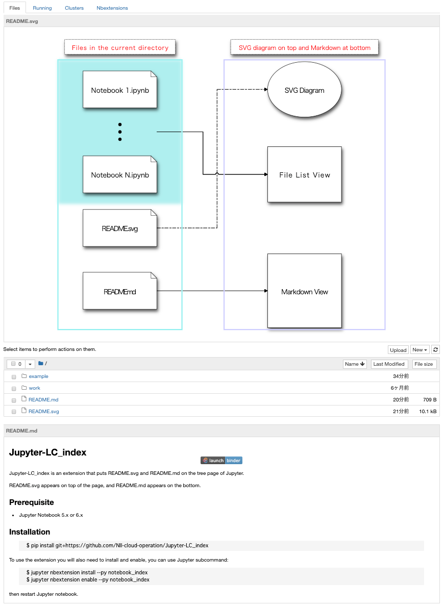

# Jupyter-LC\_index [](https://mybinder.org/v2/gh/NII-cloud-operation/Jupyter-LC_index/master)

Jupyter-LC\_index is an extension that puts README.svg and README.md on the tree page of Jupyter.



README.svg appears on top of the page, and README.md appears on the bottom.

## Requirements

* JupyterLab >= 4.0.0

## Install

        $ pip install git+https://github.com/NII-cloud-operation/Jupyter-LC_index

To use the extension you will also need to install and enable, you can use Jupyter subcommand:

        $ jupyter nbclassic-extension install --py notebook_index
        $ jupyter nbclassic-extension enable --py notebook_index

then restart Jupyter lab.

## How to Use
https://github.com/mnagaku/notebooks-diagram is a good example.

## Uninstall

To remove the extension, execute:

```bash
pip uninstall lc_index
```

## Contributing

### Development install

Note: You will need NodeJS to build the extension package.

The `jlpm` command is JupyterLab's pinned version of
[yarn](https://yarnpkg.com/) that is installed with JupyterLab. You may use
`yarn` or `npm` in lieu of `jlpm` below.

```bash
# Clone the repo to your local environment
# Change directory to the lc_index directory
# Install package in development mode
pip install -e .
# Link your development version of the extension with JupyterLab
jupyter labextension develop . --overwrite
# Rebuild extension Typescript source after making changes
jlpm build
```

You can watch the source directory and run JupyterLab at the same time in different terminals to watch for changes in the extension's source and automatically rebuild the extension.

```bash
# Watch the source directory in one terminal, automatically rebuilding when needed
jlpm watch
# Run JupyterLab in another terminal
jupyter lab
```

With the watch command running, every saved change will immediately be built locally and available in your running JupyterLab. Refresh JupyterLab to load the change in your browser (you may need to wait several seconds for the extension to be rebuilt).

By default, the `jlpm build` command generates the source maps for this extension to make it easier to debug using the browser dev tools. To also generate source maps for the JupyterLab core extensions, you can run the following command:

```bash
jupyter lab build --minimize=False
```

### Development uninstall

```bash
pip uninstall lc_index
```

In development mode, you will also need to remove the symlink created by `jupyter labextension develop`
command. To find its location, you can run `jupyter labextension list` to figure out where the `labextensions`
folder is located. Then you can remove the symlink named `lc_index` within that folder.

### Packaging the extension

See [RELEASE](RELEASE.md)